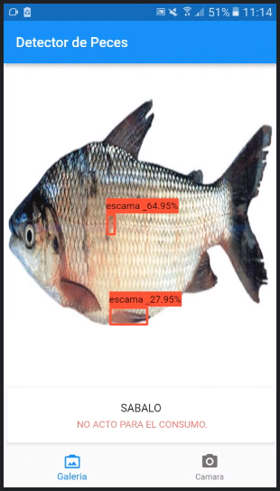

# flutter-peces-app-yolov5

- aplicacion de ayuda para identificar peces en mal estado y clasificarlos por su tipo.

## ejemplo
- Use el complemento `pytorch_lite` para ejecutar el modelo en las imágenes. La imagen es capturada por la cámara o seleccionada de la galería (con la ayuda del complemento image_picker ).

 
 
 

la aplicacion fue probada en un version de android 11.0 [descargar](https://drive.google.com/file/d/11DDqFlhUdjT3oSZGXxpDpH4ErW6_UTVm/view?usp=sharing) app-release.apk


## instalar 

```
flutter packages get
```

## correr

```
flutter run
```

# modelos
Los modelos se encuentran en la carpeta `assets`.
 - assets/models/labels_objectDetection_Peces_yolov5.torchscript
 - assets/labels/labels_objectDetection_Peces_yolov5.txt
 - assets/models/labels_objectClasificacion_Peces_yolov5.torchscript
 - assets/labels/labels_objectClasificacion_Peces_yolov5.txt

## creacion de los modelos en colab
[](https://colab.research.google.com/drive/1S3H1voQy0Dj4WgkDlKj8y2h8fBzb8eBh?usp=sharing) Deteccion de peces en mal estado usando YOLOv5

[](https://colab.research.google.com/drive/1WxDoBRMTYYLJq8ROm792vBWTjAsYSrGY?usp=sharing) Deteccion y clasificacion de peces usando YOLOv5

## documentacion
documento [ver](https://drive.google.com/file/d/1g7fN8oRauw2wdr6Th3jvOFKSnUzN3o3t/view?usp=sharing) 

## Getting Started

This project is a starting point for a Flutter application.

A few resources to get you started if this is your first Flutter project:

- [Lab: Write your first Flutter app](https://docs.flutter.dev/get-started/codelab)
- [Cookbook: Useful Flutter samples](https://docs.flutter.dev/cookbook)

For help getting started with Flutter development, view the
[online documentation](https://docs.flutter.dev/), which offers tutorials,
samples, guidance on mobile development, and a full API reference.
